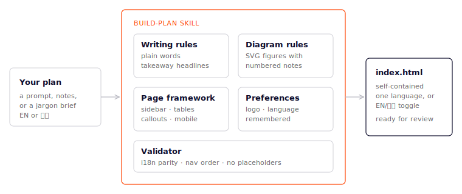
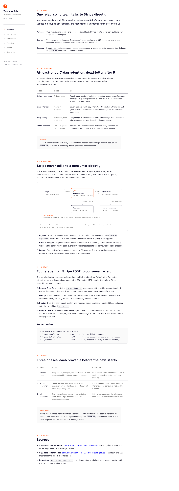

# build-plan

An agent skill that turns a plan (build plan, technical design plan, proposal,
playbook) into a polished, self-contained HTML page: fixed sidebar with
numbered sections, plain-language writing rules, inline SVG diagrams, an
optional language toggle (any languages, two or more; EN/中文 in the
examples), and your repo's logo.

## Install

```bash
npx skills add yulonghe97/build-plan --skill build-plan -g
```

Drop `-g` for a repo-local install.

## What it does



In priority order:

1. **Plain language, enforced.** Headlines carry takeaways ("Six steps, only
   two model calls", not "Workflow Overview"), short paragraphs, numbers over
   adjectives, no jargon, no em-dashes. Same rules in every language.
2. **Diagrams over prose.** Anything structural (architecture, flows, loops,
   timelines) becomes an inline SVG figure with a numbered explanation below
   it, drawn with the framework's own primitives.
3. **One self-contained `index.html`** in a restrained white/ink/orange
   style: fixed sidebar with numbered sections, active-section tracking,
   tables, callouts, mobile layout. No build step, opens anywhere.
4. **Single language by default; more on request.** Additional languages
   (any, and more than two; EN/中文 is just one pair) add a language toggle
   with dictionary key parity enforced by the bundled validator.
5. **Remembers your setup.** Repo logo discovery and language choice are
   saved (agent memory plus `.context/build-plan-prefs.json`), so the second
   page never re-asks what the first one learned.

## Example

One prompt in, one page out. The screenshots below are unedited output from
the test suite (`evals/evals.json`), generated by the skill from a
three-sentence prompt describing a webhook relay service:



Multilingual mode (opt-in, remembered once you choose) ships a language
toggle with key-parity validation; this example happens to use EN/中文:


Both pages are in [`examples/`](examples/) — open them locally, they are
self-contained.

## Layout

```
SKILL.md                     the skill
assets/technical-page.html   canonical page framework (copy, then fill)
scripts/validate-page.mjs    validates i18n parity, nav order, placeholders,
                             and estimated SVG text overflow (all languages)
evals/evals.json             test prompts used to iterate on the skill
examples/                    unedited pages generated by the test suite
```
